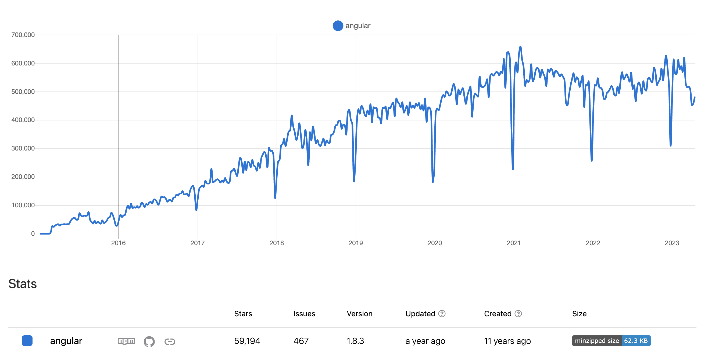
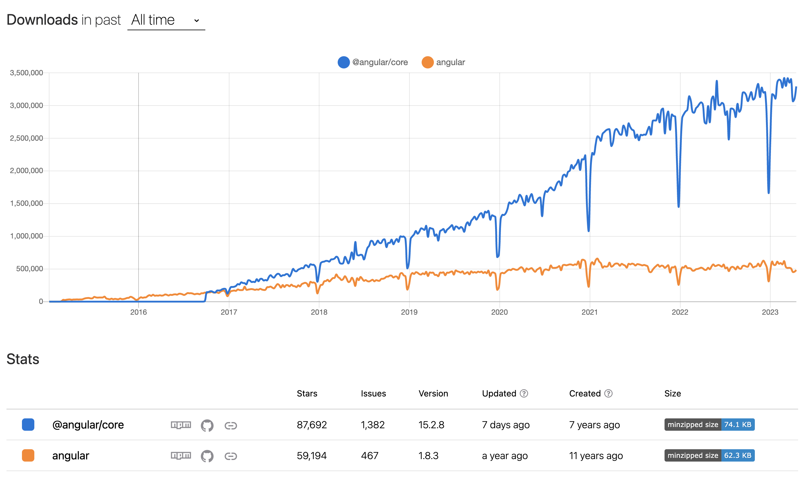
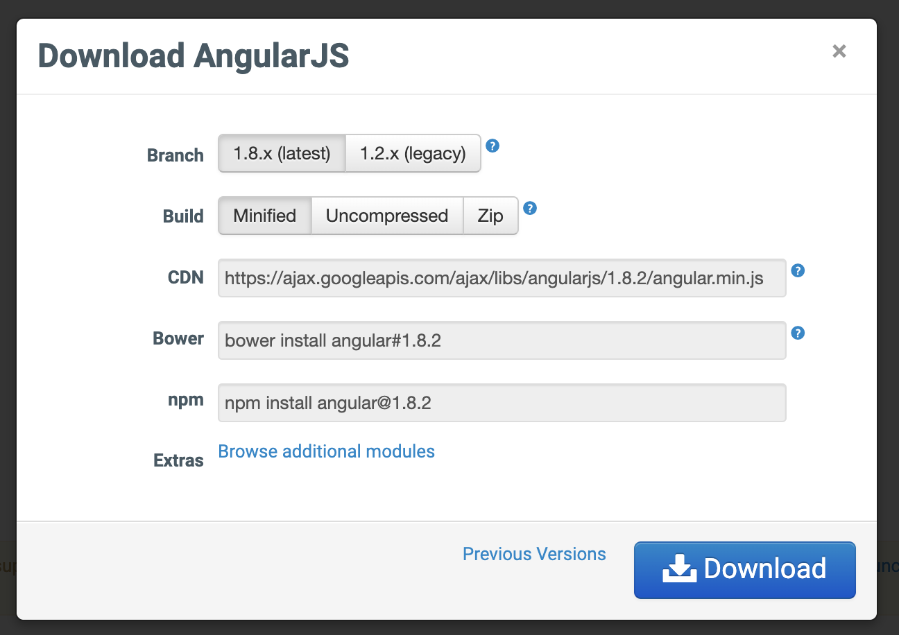

# The AngularJS <br />…we patch

<aside class="notes">
So I prepared the presentation 📝

We do the patches, we deliver something but what EXACTLY do we deliver and why it's so important?

Lets find out!
</aside>

--- ---

## The Problem <br/>AngularJS solves

Handling extremly complex HTML dynamic views

<aside class="notes">
"Everyday new JS frameworks is born"

So nowadays most projects are JS centric and everythings starts from there.

At this moment it's over 12 years that AngularJS exists. Quite a good time to live for a JS framework, eh?

AngularJS was extremly suitable to enhance complex Web Services with full control of the HTML view, but who lacks of rising Web 2.0 applications dynamics control and system approach which were done by the time with jQuery/jQuery UI.

Some of the competitors where: Backobone.js (which didn't had solid code style opinion) and Knockout.js (mini version of AngularJS, people used that if that was to big).
</aside>

--- ---

## The Problem <br/>AngularJS solves

----

## MV* pattern?

Model-View-Whatever 😅

----

## Simple MV* pattern

Controllers

```html [1|4|5|6|9|10]
<div ng-controller="MyController">
    <h1>My Items</h1>
    <ul>
        <li ng-repeat="item in items">
            {{item.name}} - {{item.price | currency}}
            <button ng-click="removeItem($index)">Remove</button>
        </li>
    </ul>
    <p>Total Price: {{getTotalPrice() | currency}}</p>
    <button ng-click="addItem()">Add Item</button>
</div>
```

----

## Simple MV* pattern

Controllers

```javascript [1|2-4|]
angular.module('myApp', []).controller('MyController',[
function(
    $scope
) {
    $scope.items = [ {name: 'Item 1', price: 10}];
    
    $scope.getTotalPrice = function() {
        return total;
    };
    
    $scope.addItem = function() // …
    
    $scope.removeItem = function(index) // …
}]);
```

----

## Simple MV* pattern

Directives

```html [|1|2|3|4]
<highlight-completed></highlight-completed>`
<div highlight-completed></div>
<div class="highlight-completed: exp;"></div>
<-- highlight-completed: exp; -->
```

```javascript [|2|3|4-10|11|12]
angular.module('todoApp', [])
.directive('highlightCompleted', function() { return {
    restrict: 'EACM',
    link: function(scope, element, attrs) {
        scope.$watch('todos', (newValue, oldValue) => {
            angular.forEach(completedItems, (item) => {
                item.style.backgroundColor = '#f9f9f9';
            });
        }, true);
    },
    template: 'Name: {{customer.name}}'
    templateUrl: './highlightCompleted.html'
} });
```

----

## Simple MV* pattern

Components

```javascript [2|7-14|9-13|17-19]
angular.module('myMod', ['ngRoute']);
    .component('home', {
        template: `
            <h1>Home</h1>
            <p>Hello, {{ $ctrl.user.name }} !</p>
        `,
        controller: function() {
            this.user = {name: 'world'};
            this.$onInit = function() {} // …
            this.$onChanges = function() {} // …
            this.$doCheck = function() {} // …
            this.$onDestroy = function() {} // …
            this.$postLink = function() {} // …
        }
    });
    .config(function($routeProvider) {
        $routeProvider.when('/', {
            template: '<home></home>'
        });
    });
```

----

## Simple MV* pattern

Services, Factories and Providers

```javascript [2|3-8|12-14]
angular.module('todoApp', [])
    .factory('TodoService', function() {
        return {
          getTodos: function() {},
          addTodo: function(todo) {},
          deleteTodo: function(todo) {},
          toggleCompleted: function(todo) {}
        }
    })
    .component('todoList', {
        templateUrl: 'todoList.html',
        controller: [
            "TodoService", function(TodoService) {}
        ]
    });
```

----

## Simple MV* pattern

Dependency Injection to glue this all

```php [1|2|4]
app.controller('MyController', [
    '$scope', 'myService', 'myFactory', 'myProvider',
    function(
        $scope, myService, myFactory, myProvider
    ) {
        // Controller code goes here
    }
]);
```

--- ---

## Its outdated?

Not supported! But not outdated because…

> if application works don't rewrite it! 📝
<!-- .element: class="fragment" data-fragment-index="1" -->

<aside class="notes">
blank
</aside>

----

## NPM stats

<div class="r-stack">


<!-- .element: class="fragment" data-fragment-index="1" -->


<!-- .element: class="fragment" data-fragment-index="2" -->


<!-- .element: class="fragment" data-fragment-index="3" -->

</div>

<aside class="notes">
Angular is still downloaded alot singe angular started. Even grow a little…

Count in the stats which are missing for downloading from CDN and direct download
</aside>

--- ---

## What are the official packages?

```javascript [2|3|4|5|6|7|8|9|10|11|12|16-18|19]
const injectModules = [
    require("angular-animate"),
    require("angular-aria"),
    require("angular-cookies"),
    require("angular-resource"),
    require("angular-route"),
    require("angular-sanitize"),
    require("angular-message-format"),
    require("angular-messages"),
    require("angular-parse-ext"),
    require("angular-touch"),
    require("angular-i18n/en"),
];

const testModules = [
    require("angular-mocks.js/ngMock"),
    require("angular-mocks.js/ngMockE2E"),
    require("angular-mocks.js/ngAnimateMocks"),
    require("angular-scenario"),
];
```

<aside class="notes">
Sure, here's a brief description of each of the officially supported AngularJS packages:

* `angular-animate`: This package provides support for animation features in AngularJS, including CSS-based transitions and animations.

* `angular-aria`: This package provides support for Accessible Rich Internet Applications (ARIA) in AngularJS, making it easier to build web applications that are accessible to users with disabilities.

* `angular-cookies`: This package provides support for working with cookies in AngularJS, including the ability to read, write, and delete cookies.

* `angular-resource`: This package provides support for working with RESTful web services in AngularJS, including the ability to make GET, POST, PUT, and DELETE requests.

* `angular-route`: This package provides support for routing in AngularJS, allowing you to build single-page applications that have multiple views.

* `angular-sanitize`: This package provides support for sanitizing HTML inputs in AngularJS, helping to prevent security vulnerabilities such as cross-site scripting (XSS) attacks.

* `angular-message-format`: This package provides support for formatting messages in AngularJS, allowing you to build applications that can be easily translated into different languages.

* `angular-messages`: This package provides support for displaying form validation error messages in AngularJS, making it easier to build forms that validate user input.

* `angular-parse-ext`: This package provides support for parsing complex data structures in AngularJS, including the ability to parse dates, regular expressions, and more.

* `angular-touch`: This package provides support for touch-based interactions in AngularJS, making it easier to build web applications that work well on touch-enabled devices.

* `angular-i18n/en`: This package provides support for internationalization (i18n) in AngularJS, including translations for the English language.

Overall, these packages provide a wide range of functionality to help developers build robust, feature-rich web applications with AngularJS.

* `angular-scenario.js` was a package included in AngularJS versions up to 1.7. It provided a way to write end-to-end tests for AngularJS applications using a special testing framework called "Angular Scenario".

The Angular Scenario framework allowed developers to write tests that simulated user interactions with the application, such as clicking buttons, filling out forms, and navigating to different views. The tests were written in a special syntax that was designed to be easy to read and write, even for developers who were not experienced with testing.

However, as of AngularJS 1.8, the angular-scenario.js package has been removed from the framework. The Angular team recommends that developers use other testing frameworks, such as Protractor or Jest, to write end-to-end tests for their AngularJS applications. These frameworks offer more advanced features and better integration with modern development workflows.
</aside>

----

## What are these specificly?

Lets review that are the old modules! 👨🏻‍💻

----

## `angular-animate`


[ngAnimate module](https://docs.angularjs.org/api/ngAnimate)

<aside class="notes">

* `angular-animate`: This package provides support for animation features in AngularJS, including CSS-based transitions and animations.

</aside>

----

## `angular-aria`

[ngAria module](https://docs.angularjs.org/api/ngAria)

<aside class="notes">

* `angular-aria`: This package provides support for Accessible Rich Internet Applications (ARIA) in AngularJS, making it easier to build web applications that are accessible to users with disabilities.

</aside>

----

## `angular-cookies`

```javascript
angular.module('cookiesExample', ['ngCookies'])
.controller('ExampleController', ['$cookies', function($cookies) {
  // Retrieving a cookie
  var favoriteCookie = $cookies.get('myFavorite');
  // Setting a cookie
  $cookies.put('myFavorite', 'oatmeal');
}]);
```

[ngCookies module](https://docs.angularjs.org/api/ngCookies)

<aside class="notes">

* `angular-cookies`: This package provides support for working with cookies in AngularJS, including the ability to read, write, and delete cookies.

</aside>

----

## `angular-resource`

```javascript
app.factory('Notes', ['$resource', function($resource) {
  return $resource('/notes/:id', {id: '@id'}, {
    update: {method: 'PUT'}
  });
}]);
```

[ngResource module](https://docs.angularjs.org/api/ngResource)

<aside class="notes">

* `angular-resource`: This package provides support for working with RESTful web services in AngularJS, including the ability to make GET, POST, PUT, and DELETE requests.

</aside>

----

## `angular-route`

[ngRoute module](https://docs.angularjs.org/api/ngRoute)

<aside class="notes">

* `angular-route`: This package provides support for routing in AngularJS, allowing you to build single-page applications that have multiple views.

</aside>

----

## `angular-sanitize`

[ngSanitize module](https://docs.angularjs.org/api/ngSanitize)

<aside class="notes">

* `angular-sanitize`: This package provides support for sanitizing HTML inputs in AngularJS, helping to prevent security vulnerabilities such as cross-site scripting (XSS) attacks.

</aside>

----

## `angular-message-format`

```html [|5-10]
<div ng-controller="AppController">
    Select Recipient:<br>
     <select ng-model="recipient" ng-options="person as person.name for person in recipients">
         </select>
     <p>{{recipient.gender, select,
         male {{{recipient.name}} unwrapped his gift. }
               female {{{recipient.name}} unwrapped her gift. }
               other {{{recipient.name}} unwrapped their gift. }
     }}</p>
</div>
```

[ngMessageFormat module](https://docs.angularjs.org/api/ngMessageFormat)

<aside class="notes">

* `angular-message-format`: This package provides support for formatting messages in AngularJS, allowing you to build applications that can be easily translated into different languages.

</aside>

----

## `angular-messages`

[ngMessages module](https://docs.angularjs.org/api/ngMessages)

```html [|5-10]
<form name="myForm">
  <label>
    Enter text:
    <input type="email" ng-model="field" name="myField" required maxlength="15" />
  </label>
  <div ng-messages="myForm.myField.$error" role="alert">
    <div ng-message="required">Please enter a value for this field.</div>
    <div ng-message="email">This field must be a valid email address.</div>
    <div ng-message="maxlength">This field can be at most 15 characters long.</div>
  </div>
</form>
```

<aside class="notes">

* `angular-messages`: This package provides support for displaying form validation error messages in AngularJS, making it easier to build forms that validate user input.

</aside>

----

## `angular-parse-ext`

[ngParseExt module](https://docs.angularjs.org/api/ngParseExt)

Enables the<br />`<div ng-repeat="f in поля"></div>`

<aside class="notes">

* `angular-parse-ext`: This package provides support for parsing complex data structures in AngularJS, including the ability to parse dates, regular expressions, and more.

</aside>

----

## `angular-touch`

[ngTouch module](https://docs.angularjs.org/api/ngTouch)

Note: It still provided though marked as deprecated, recomended [Hammer.js](https://hammerjs.github.io) instead… It is what it is.

<aside class="notes">

* `angular-touch`: This package provides support for touch-based interactions in AngularJS, making it easier to build web applications that work well on touch-enabled devices.

</aside>

----

## `angular-i18n/en`

Add some AngularJS supports `i18n`/`l10n` for `date`, `number` and `currency` filters.

```javascript
§provide. value ("$locale", {
    "DATETIME_FORMATS": {..},
    "NUMBER FORMATS": {..},
    "id": "en"
    "localeID": "en",
    "pluralCat": () => …
})
```

<aside class="notes">

* `angular-i18n/en`: This package provides support for internationalization (i18n) in AngularJS, including translations for the English language.

Overall, these packages provide a wide range of functionality to help developers build robust, feature-rich web applications with AngularJS.

</aside>

----

## `angular-mocks`/`ngMock`

[ngMock module](https://docs.angularjs.org/api/ngMock)

Has different utils for writing tests, like [$exceptionHandler](https://docs.angularjs.org/api/ngMock/service/$exceptionHandler) or ability to make custom injections with [angular.mock.inject](https://docs.angularjs.org/api/ngMock/function/angular.mock.inject)


----

## `angular-mocks`/`ngMockE2E`

```javascript
var myAppDev = angular.module('myAppDev', [
    'myApp', 'ngMockE2E'
]);
myAppDev.run(function($httpBackend) {
  var phones = [{name: 'phone1'}, {name: 'phone2'}];

  // returns the current list of phones
  $httpBackend.whenGET('/phones')
    .respond(phones);

  // adds a new phone to the phones array
  $httpBackend.whenPOST('/phones')
    .respond(function(method, url, data) {
        var phone = angular.fromJson(data);
        phones.push(phone);
        return [200, phone, {}];
    });
  // Requests for templates are handled by the real server
  $httpBackend.whenGET(/^\/templates\//).passThrough(); 
  //...
});
angular.element(function() {
    angular.bootstrap(document, ['myApp']);
});
```

----

## `angular-scenario` (< v1.7)

<aside class="notes">

* `angular-scenario.js` was a package included in AngularJS versions up to 1.7. It provided a way to write end-to-end tests for AngularJS applications using a special testing framework called "Angular Scenario".

The Angular Scenario framework allowed developers to write tests that simulated user interactions with the application, such as clicking buttons, filling out forms, and navigating to different views. The tests were written in a special syntax that was designed to be easy to read and write, even for developers who were not experienced with testing.

However, as of AngularJS 1.8, the angular-scenario.js package has been removed from the framework. The Angular team recommends that developers use other testing frameworks, such as Protractor or Jest, to write end-to-end tests for their AngularJS applications. These frameworks offer more advanced features and better integration with modern development workflows.

</aside>


--- ---

## How it's tested?

Let's review now! 👨🏻‍💻

----

TBD
